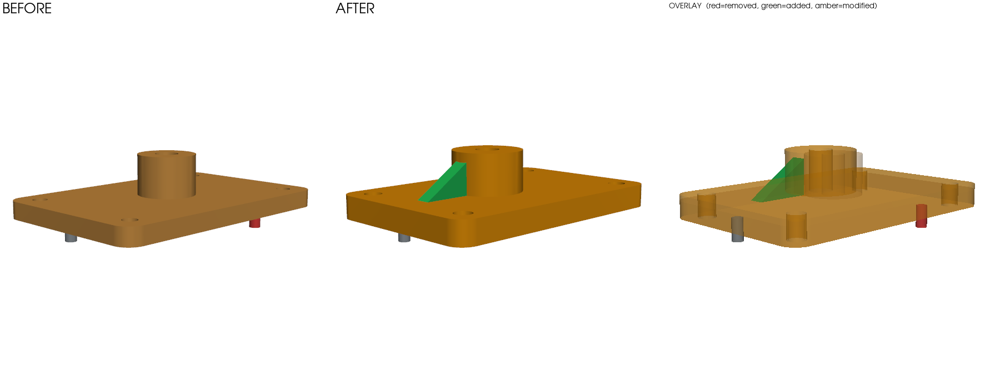

# argus-diff

[](https://github.com/mikelmyers/argus-diff/actions/workflows/ci.yml)

**Site & waitlist:** [argus-diff.vercel.app](https://argus-diff.vercel.app) ·
**Live demo:** [the Action commenting a geometric diff on a real PR](https://github.com/mikelmyers/argus-demo/pull/2)

**git diff for atoms.** Geometric diff for mechanical CAD: point it at two
revisions of a CAD file — STEP, STL, 3MF, OBJ, PLY — and it tells you what
actually changed — bodies added/removed/modified,
mass and volume deltas, bounding box growth, solid-solid interference — as
structured JSON, a terminal summary, and a rendered before/after/overlay image.
With CI gate flags, so a mechanical change can fail a pull request the way a
broken test does.

> AI agents now produce engineering artifacts faster than humans can review
> them. Verification is the bottleneck. ECAD has diff/review tooling; mechanical
> CAD — the larger population — reviews screenshots in Slack. This fixes that.

## Install

```bash
# PyPI release is queued; until then install from GitHub:
pip install "argus-diff[render] @ git+https://github.com/mikelmyers/argus-diff"
```

## Use

```bash
argus diff old.step new.step
argus diff old.step new.step --json diff.json --render diff.png --density 2.70
argus diff old.step new.step --fail-on-interference --max-mass-delta-pct 2   # CI gate
```

Example: a sensor-mount bracket between two revisions — plate thickened,
mounting holes opened up, boss enlarged and shifted, a gusset added (modeled
slightly overlapping the boss — caught), a locating pin deleted:



```
argus-diff 0.1.0
  before: bracket_rev_a.step  (4 bodies)
  after:  bracket_rev_b.step  (4 bodies)

  + 1 added   - 1 removed   ~ 2 modified   = 1 unchanged

  volume: 35638.9 -> 48318.3 mm^3 (+35.58%)
  mass:   96.23 -> 130.46 g @ 2.7 g/cm^3 (+34.23 g)
  interferences (after): 1
    ~ body_0 -> body_0: vol +32.46%, com shift 1.000 mm
        . 4x cylinder face: radius 2.500 -> 3.000 mm, area 94.25 -> 150.80 mm^2, moved 1.000 mm
        . 2x plane face: area 468.00 -> 624.00 mm^2, moved 1.000 mm
    ~ body_1 -> body_1: vol +52.38%, com shift 6.325 mm
        . cylinder face: radius 10.000 -> 12.000 mm, area 879.65 -> 1055.58 mm^2, moved 6.325 mm
    + body_2: 540.0 mm^3
    - body_2: 100.5 mm^3
    ! interference body_1 x body_2: 108.650 mm^3 overlap
```

Yes — that's the four corner holes opening from ⌀5 to ⌀6 and the boss growing
from ⌀20 to ⌀24, localized to the faces, by name. (Face output truncated here;
run it to see all lines.)

Exit codes: `0` ok, `1` a gate failed, `2` load/usage error — drop it straight
into CI.

## In CI / on pull requests

`argus ci` diffs every STEP file changed between two git refs and emits a
PR-comment-ready markdown report plus per-file renders:

```bash
argus ci --base origin/main --render-dir renders/ --markdown report.md \
         --fail-on-interference --max-mass-delta-pct 2
```

Or use the GitHub Action — it comments the report on the PR and uploads the
renders as artifacts:

```yaml
# .github/workflows/cad-review.yml
on: pull_request
permissions:
  contents: read
  pull-requests: write
jobs:
  cad:
    runs-on: ubuntu-latest
    steps:
      - uses: actions/checkout@v4
      - uses: mikelmyers/argus-diff@main
        with:
          density: "2.70"
          fail-on-interference: "true"
          max-mass-delta-pct: "2"
```

## Read more

[What changed in this 70 MB STEP file? Now you can actually know.](docs/posts/what-changed-in-this-70mb-step-file.md) — argus-diff
run on two real revisions from the Jubilee toolchanger's history.

## How it works

- STEP is loaded with the open-source OCCT kernel (via
  [cadquery](https://github.com/CadQuery/cadquery)/OCP); assemblies are
  flattened to solids.
- Each body gets a geometric fingerprint: volume, surface area, center of
  mass, bounding box, volume-normalized principal moments of inertia, face and
  edge counts.
- Bodies are matched between revisions greedily by fingerprint distance;
  matched-but-different = **modified**, unmatched = **added**/**removed**.
- Interference = pairwise boolean-common volume between solids in the new
  revision (bbox-prefiltered).
- Renders are tessellated and drawn offscreen with pyvista — works headless
  under `xvfb-run`.

Every number in this README is reproducible: `python examples/make_examples.py`
generates the part pair, the command above generates the output.

## Scope (honest)

Alpha. Today: STEP/STL/3MF/OBJ/PLY in, body-level diff out; change
localization is analytic on B-rep ("4x cylinder face: radius 2.500 ->
3.000 mm") and region-based on meshes ("changed region near (149, 124, 2)
mm: max deviation 2.02 mm", rigid translation removed first and stated).
`--cache` makes repeat runs on unchanged files near-instant (measured
480x on a 2x70 MB pair). Mesh files skip the interference check (no exact
booleans on meshes yet) and report it as skipped, not as zero; open
(non-watertight) meshes report volume as unavailable rather than a
made-up number. Not yet: rotation-aware mesh alignment (ICP),
feature-tree awareness, drawing/PMI diff, proprietary formats (SolidWorks
et al.). Roadmap is driven by what users actually hit — file an issue.

## License

MIT.
